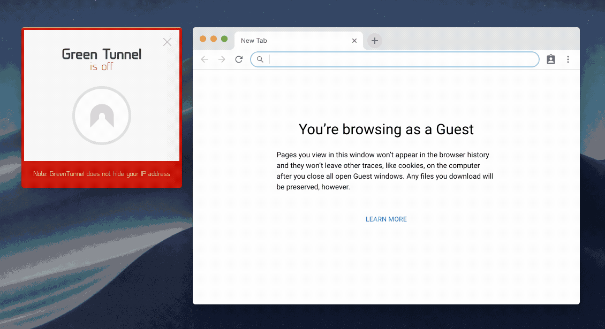

# Green Tunnel
<p align="center">
    
</p>
<p align="center">
     
</p>

GreenTunnel bypasses DPI (Deep Packet Inspection) systems found in many ISPs (Internet Service Providers) which block access to certain websites.

<p align="center">
    
</p>

## How to use
### Graphical user interface (GUI)
You can simply choose the suitable installation for your OS in the [releases](https://github.com/SadeghHayeri/GreenTunnel/releases "releases") section.

### Command-line interface (CLI)
You can install GreenTunnel using [npm](https://www.npmjs.org/ "npm"):
```
$ npm i -g green-tunnel
```
after installation you can run it using `gt` or `green-tunnel` commands.

```
$ gt --help
Usage: green-tunnel [options]
Usage: gt [options]

Options:
  --help       Show help                                                      [boolean]
  --version    Show version number                                            [boolean]
  --ip         ip address to bind proxy server                   [default: "127.0.0.1"]
  --port       port address to bind proxy server                    [default: "random"]
  --dnsType     [choices: "DNS_OVER_HTTPS", "DNS_OVER_TLS"] [default: "DNS_OVER_HTTPS"]
  --dnsServer                         [default: "https://cloudflare-dns.com/dns-query"]

Examples:
  gt #run with default options
  gt --ip 127.0.0.1 --port 8000
  gt --dnsServer https://doh.securedns.eu/dns-query

ISSUES:  https://github.com/SadeghHayeri/GreenTunnel/issues
```

### Tested on
- MacOS Mojave 10.14 with node 8 and npm 6
- Ubuntu 18.04 with node 8 and npm 6
- Windows 10 with node 8 and npm 6


## FAQ
> **How does it work?**
###### DNS
When you enter a URL in a Web browser, the first thing the Web browser does is to ask a DNS (Domain Name System) server, at a known numeric address, to look up the domain name referenced in the URL and supply the corresponding IP address.
If the DNS server is configured to block access, it consults a blacklist of banned domain names. When a browser requests the IP address for one of these domain names, the DNS server gives a wrong answer or no answer at all.
GreenTunnel use [DNS over HTTPS](https://en.wikipedia.org/wiki/DNS_over_HTTPS "doh (DNS over HTTPS)") and [DNS over TLS](https://en.wikipedia.org/wiki/DNS_over_TLS "DNS over TLS") to get real IP address and bypass DNS Spoofing.

###### HTTP
There are gaps in providers in DPI.  They happen from what the DPI rules write for ordinary user programs, omitting all possible cases that are permissible by standards.  This is done for simplicity and speed.
Some DPIs cannot recognize the HTTP request if it is divided into TCP segments.  For example, a request of the form

```
GET / HTTP/1.0`
Host: www.youtube.com
...
```
we send it in 2 parts: first comes `GET / HTTP/1.0 \n Host: www.you` and second sends as `tube.com \n ...`. in this example ISP can not found blocked word **youtube** in packets and bypass it!

###### HTTPS
Server Name Indication (SNI) is an extension to TLS (Transport Layer Security) that indicates the actual destination hostname a client is attempting to access over HTTPS. For this Web Filter feature, SNI hostname information is used for blocking access to specific sites over HTTPS. For example, if the administrator chooses to block the hostname **youtube** using this feature, all Website access attempts over HTTPS that contain **youtube** like **www.youtube.com** in the SNI would be blocked. However, access to the same hostname over HTTP would not be blocked by this feature. GreenTunnel tries to split first **CLIENT-HELLO** packet into small chunks and ISPs can't parse packet and found SNI field so bypass traffic!


## Development notes
GreenTunnel is an open-source app and I really appreciate other developers adding new features and/or helping fix bugs. If you want to contribute to GreenTunnel, you can fork this repository, make the changes and create a pull request.

However, please make sure you follow a few rules listed below to ensure that your changes get merged into the main repo. The rules listed below are enforced to make sure the changes made are well-documented and can be easily kept track of.

- ⇄ Pull requests and ★ Stars are always welcome.
- For bugs and feature requests, please create an issue.
- Make sure your pull request has an informative title. You should use prefixes like `ADD:`, `FIX:`, etc at the start of the title which describes the changes followed by a one-line description of the changes. Example: ADD: Added a new feature to GreenTunnel
- Commits in your fork should be informative, as well. Make sure you don't combine too many changes into a single commit.

## TODO List
- [ ] enable/disable proxy on windows
- [ ] HTTPHandler
- [X] add CLI arguments
- [ ] catch all exceptions
- [ ] add preferences menu

## License
Licensed under the MIT license. See [LICENSE](https://github.com/SadeghHayeri/GreenTunnel/blob/master/LICENSE "LICENSE").

