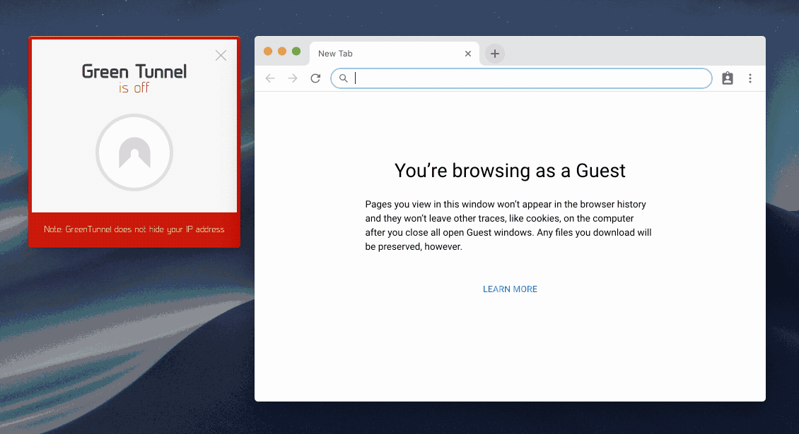

# Green Tunnel

<p align="center">
    
</p>
<p align="center">
    
    
    
</p>

GreenTunnel bypasses DPI (Deep Packet Inspection) systems found in many ISPs (Internet Service Providers) which block access to certain websites.

> **Note:** GreenTunnel does not hide your IP address. It only bypasses DPI-based censorship.

<p align="center">
    
</p>

---

## Installation

### Requirements

- **Node.js 20+**

### npm (recommended)

```bash
npm install -g green-tunnel
```

After installation, run with `gt` or `green-tunnel`.

### Docker

```bash
docker run -p 8000:8000 sadeghhayeri/greentunnel
```

---

## Usage

### CLI

```
Usage: green-tunnel [options]
Usage: gt [options]

Options:
  --ip                   IP address to bind proxy server     [string]  [default: "127.0.0.1"]
  --port                 Port to bind proxy server           [number]  [default: 8000]
  --https-only           Block insecure HTTP requests        [boolean] [default: false]
  --dns-type             DNS resolver type                   [string]  [choices: "https", "tls", "unencrypted"] [default: "https"]
  --dns-server           DNS server URL                      [string]  [default: "https://cloudflare-dns.com/dns-query"]
  --dns-ip               IP for unencrypted DNS              [string]  [default: "127.0.0.1"]
  --dns-port             Port for unencrypted DNS            [number]  [default: 53]
  --tls-record-frag...   Enable TLS record fragmentation     [boolean] [default: false]
  --silent, -s           Run in silent mode                  [boolean] [default: false]
  --verbose, -v          Debug mode (e.g. 'green-tunnel:*')  [string]
  --system-proxy         Auto-set system proxy               [boolean] [default: true]
  --help, -h             Show help
  --version, -V          Show version number
```

**Examples:**

```bash
# Basic usage (auto-sets system proxy)
gt

# Custom port
gt --port 9000

# Use a different DoH server
gt --dns-server https://doh.securedns.eu/dns-query

# Enable TLS record fragmentation (for stricter DPI)
gt --tls-record-fragmentation

# Debug mode
gt --verbose 'green-tunnel:*'
```

### Docker

```bash
# Basic
docker run -p 8000:8000 sadeghhayeri/greentunnel

# Custom port
docker run -e PORT=9000 -p 9000:9000 sadeghhayeri/greentunnel

# Run in background, restart on reboot
docker run -d --restart unless-stopped -p 8000:8000 sadeghhayeri/greentunnel
```

**Environment variables:**

| Variable | Description | Default |
|---|---|---|
| `PORT` | Proxy port | `8000` |
| `HTTPS_ONLY` | Block HTTP traffic | `false` |
| `DNS_TYPE` | `https`, `tls`, or `unencrypted` | `https` |
| `DNS_SERVER` | DNS server URL | Cloudflare DoH |
| `SILENT` | Suppress output | `false` |
| `VERBOSE` | Debug namespace | — |

### Graphical Interface (GUI)

Download the pre-built installer for your OS from the [releases](https://github.com/SadeghHayeri/GreenTunnel/releases) page.

---

## How It Works

### HTTP

Some DPI systems fail to detect blocked content when an HTTP request is split across multiple TCP segments. GreenTunnel splits the request so the `Host` header straddles a segment boundary, preventing the DPI from matching the blocked hostname.

### HTTPS / SNI Fragmentation

TLS's Server Name Indication (SNI) extension sends the target hostname in plaintext during the handshake. DPI systems use this to block HTTPS connections. GreenTunnel splits the initial `ClientHello` TLS record into small fragments so the DPI cannot reassemble and inspect the SNI field.

Optionally, `--tls-record-fragmentation` breaks the TLS record at a lower level for stricter DPI environments.

### Encrypted DNS

Standard DNS lookups can be intercepted or spoofed by ISPs to block domains at the DNS level. GreenTunnel uses **DNS over HTTPS (DoH)** or **DNS over TLS (DoT)** to get the real IP address, bypassing DNS-based blocking.

---

## Contributing

Pull requests and issues are always welcome.

- Use `FIX:`, `ADD:`, `UPDATE:` prefixes in PR titles.
- Keep commits focused and descriptive.
- Make sure `npm install` passes and `node -e "import('./src/index.js')"` works.

---

## Donation

> Love GreenTunnel? Please consider donating to sustain development.

**Bitcoin:** `bc1qknjsmsa98lljwxjwl4pmjh48s8su8r8ajkqd8w`
**Ethereum:** `0x018fbf3fAC7165b2c85f856cC90E2d9410415150`
**Dogecoin:** `DTGjx8KKDCUkSEbtVHgQx1GYEnNaVVuXLa`
**Litecoin:** `ltc1q5tfprazpkzjvzf5shgprkpkhnnku3p72feutxt`

[](https://www.paypal.com/cgi-bin/webscr?cmd=_donations&business=HJ5TBXVYTHS7N&currency_code=USD&source=url)

---

## License

Licensed under the [MIT License](https://github.com/SadeghHayeri/GreenTunnel/blob/main/LICENSE).
