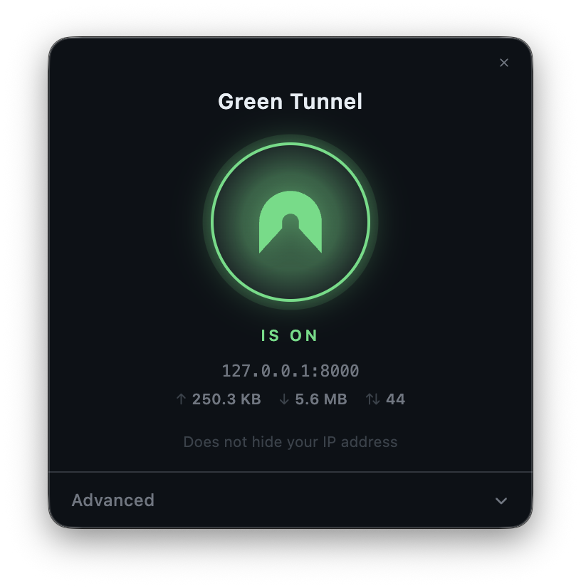
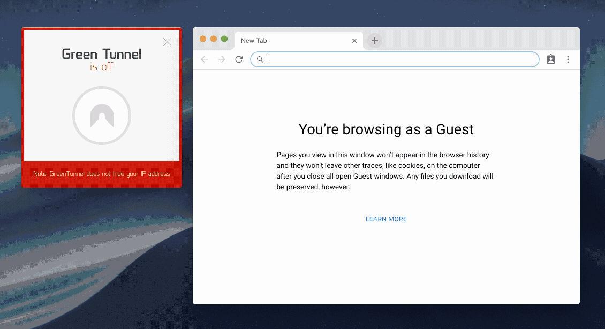

# Green Tunnel

<p align="center">
    
</p>
<p align="center">
    
    
    
</p>

GreenTunnel bypasses DPI (Deep Packet Inspection) systems found in many ISPs (Internet Service Providers) which block access to certain websites.

It runs a local proxy that splits the TLS ClientHello so the hostname you are visiting never appears whole in a single packet, and resolves DNS over an encrypted channel so your resolver cannot be used to block or observe you either.

> **Note:** GreenTunnel does not hide your IP address and is not a VPN. It defeats hostname-based blocking, nothing more.

---

<table>
<tr>
<td width="340"></td>
<td valign="top" style="padding-left: 24px;">

**GreenTunnel v3 is out now.**

A ground-up TypeScript rewrite: a new engine with real backpressure and timeouts, RFC 8484 DoH and DoT, a system-proxy layer that snapshots your settings and puts them back — even after a crash — and a rebuilt Electron app with a live log panel.

Runtime dependencies are down to two. `yargs`, `chalk`, `ora`, `debug`, `dns-socket`, `validator` and `winreg` are all gone, replaced by things Node ships with.

Open-source tools that help people reach the free internet shouldn't die — and with AI-assisted development, they don't have to. We'll keep doing our best to help people access the open internet, one packet at a time.

</td>
</tr>
</table>

<p align="center">
    
</p>

---

> ### A note from the maintainer
>
> **Contribute prompts, not pull requests.**
>
> I don't take large diffs anymore. If you want to change something in
> GreenTunnel, send the **prompt** instead — the final one, the one you'd hand to
> your own agent. Open an issue, label it **`PROMPT REQUEST`**, and paste it in.
>
> I'll run it against the codebase, review what comes out, and open the PR for
> you — **committed with your email**, so it lands in the history as your
> contribution, because it is one.
>
> Write it like you'd run it yourself: name the files, say what _done_ looks
> like, say how to verify it. Several prompts in sequence are welcome — that's
> usually how real work goes. A sharp prompt is worth more to this project than a
> big patch: it's the part I can't write for you, and it's the part that decides
> what the code becomes.
>
> Small, focused PRs — a bug fix, a typo, a dead link — are as welcome as they
> ever were. The world is changing. Let's build with it.

---

## Installation

### Requirements

- **Node.js 24+** (for the CLI and the library; the desktop app and the Docker image bring their own)

### npm (recommended)

```bash
npm install -g green-tunnel
```

After installation, run with `gt` or `green-tunnel`.

### Desktop app

Download the installer for your OS from the [releases](https://github.com/SadeghHayeri/GreenTunnel/releases) page — `.dmg` for macOS, `.exe` for Windows, `.AppImage` or `.deb` for Linux.

Builds are currently **unsigned**, so macOS Gatekeeper and Windows SmartScreen will
warn on first launch. On macOS, right-click the app and choose _Open_.

### Docker

```bash
docker run -p 8000:8000 sadeghhayeri/green-tunnel
```

---

## Usage

### CLI

```
Usage: gt [options]

Server
  --host <ip>              Address to bind          (default: 127.0.0.1)
  -p, --port <n>           Port to bind, 0 = random (default: 8000)
  --https-only             Reject plain HTTP requests

Fragmentation
  --no-fragment            Forward the ClientHello untouched
  --fragment-size <n>      Bytes per piece          (default: 40)
  --tls-records            Re-frame pieces as valid TLS records
  --fragment-delay <ms>    Pause between pieces     (default: 0)

DNS
  --dns <mode>             doh | dot | plain        (default: doh)
  --doh-url <url>          DoH endpoint             (default: Cloudflare)
  --dot-host <host>        DoT server               (default: 1.1.1.1)
  --dot-port <n>           DoT port                 (default: 853)
  --dns-server <ip>        Plain resolver, repeatable
  --family <pref>          ipv4 | ipv6 | ipv4-first | ipv6-first

Other
  --no-system-proxy        Do not touch the OS proxy settings
  --log-level <level>      silent | error | warn | info | debug | trace
  -q, --quiet              No banner, no logs
  -h, --help               Show this help
  -V, --version            Show the version
```

**Examples:**

```bash
# Basic usage (auto-sets the system proxy)
gt

# Custom port
gt --port 9000

# Stricter fragmentation, for DPI that reassembles TCP
gt --tls-records

# DNS over TLS via Quad9
gt --dns dot --dot-host 9.9.9.9

# Leave the OS alone and configure your client yourself
gt --no-system-proxy

# Debug mode
gt --log-level debug
```

**If a site is still blocked**, see [Good to know](#good-to-know).

### Docker

```bash
# Basic
docker run -p 8000:8000 sadeghhayeri/green-tunnel

# Custom port
docker run -e PORT=9000 -p 9000:9000 sadeghhayeri/green-tunnel

# Run in background, restart on reboot
docker run -d --restart unless-stopped -p 8000:8000 sadeghhayeri/green-tunnel
```

The container never touches a system proxy — point your client at it.

**Environment variables:**

| Variable         | Description                                 | Default    |
| ---------------- | ------------------------------------------- | ---------- |
| `HOST`           | Address to bind inside the container        | `0.0.0.0`  |
| `PORT`           | Proxy port                                  | `8000`     |
| `DNS_MODE`       | `doh`, `dot` or `plain`                     | `doh`      |
| `DOH_URL`        | DoH endpoint                                | Cloudflare |
| `DOT_HOST`       | DoT server, when `DNS_MODE=dot`             | `1.1.1.1`  |
| `DNS_SERVER`     | Plain resolver, when `DNS_MODE=plain`       | system     |
| `FRAGMENT_SIZE`  | Bytes per ClientHello piece                 | `40`       |
| `FRAGMENT_DELAY` | Milliseconds between pieces                 | `0`        |
| `TLS_RECORDS`    | Set to any value to re-frame as TLS records | off        |
| `NO_FRAGMENT`    | Set to any value to disable fragmentation   | off        |
| `HTTPS_ONLY`     | Set to any value to block plain HTTP        | off        |
| `LOG_LEVEL`      | `silent`…`trace`                            | `info`     |

Boolean variables are on when set to _anything_ and off when unset — `HTTPS_ONLY=false` still turns it on.

### Desktop app

A 340 px window with an on/off switch, a tray icon, and an Advanced panel for DNS transport, port, fragmentation and log level. It snapshots your system proxy settings before changing them and restores them when it stops — including after a crash, on the next launch.

### Library

```ts
import { Proxy, SystemProxy, DEFAULT_BYPASS } from 'green-tunnel';

const proxy = new Proxy({
  port: 8000,
  fragment: { size: 40, tlsRecords: true },
  dns: { mode: 'doh' },
});

const { host, port } = await proxy.start();

const system = new SystemProxy();
await system.enable({ host, port, bypass: DEFAULT_BYPASS });

proxy.on('tunnel:open', ({ kind, host }) => {
  console.log(`${kind} → ${host}`);
});

// later
await system.disable();
await proxy.stop();
```

The engine and the `gt` command ship as one package, so v2's `import { Proxy } from 'green-tunnel'` still works unchanged. Runtime dependencies are just `dns-packet` and `lru-cache`.

---

## How It Works

### HTTPS / SNI fragmentation

TLS's Server Name Indication (SNI) extension sends the target hostname in plaintext during the handshake — the one part of an HTTPS connection a DPI box can still read. GreenTunnel splits that handshake at the moment it forwards it:

- **TCP split** — the ClientHello is written across several small segments, so no single packet contains the whole hostname.
- **Record split** (`--tls-records`) — the handshake is re-framed into several individually valid TLS records. A box that reassembles TCP but inspects record-by-record still never sees a complete SNI. Legal per RFC 8446 §5.1.

### HTTP

Plain HTTP requests carry the hostname in the `Host` header, in the clear. GreenTunnel relays them through the same split, so the header straddles a segment boundary and the DPI cannot match the blocked hostname.

### Encrypted DNS

Standard DNS lookups can be intercepted or spoofed by ISPs to block domains at the DNS level. GreenTunnel resolves over **DNS over HTTPS** (RFC 8484 wire format) or **DNS over TLS**, so your ISP's resolver cannot return a poisoned answer or log the lookup.

---

## Good to know

- **A site is still blocked.** Try, in order: a smaller `--fragment-size`, then
  `--tls-records`, then `--fragment-delay 10`. Different DPI boxes reassemble
  differently, and one of the three usually gets through.
- **Quad9 over DoH doesn't work.** Their endpoint refuses HTTP/1.1, which is all
  Node's `fetch` speaks. Use `--dns dot --dot-host 9.9.9.9` instead.
- **Linux system proxy is GSettings**, so it covers GNOME and its relatives. On
  other desktops, run with `--no-system-proxy` and point your browser at the
  proxy yourself.
- **Terminal tools ignore the system proxy.** No process can set another's
  environment, so `curl`, `git` and friends need `http_proxy` / `https_proxy`
  exported — the CLI prints the exact line for you.

---

## Repository layout

```
packages/cli/        green-tunnel — the only published package
packages/cli/src/core/   the engine: proxy, TLS fragmentation, DNS, system proxy
apps/desktop/        the Electron app
```

## Development

```bash
npm install      # workspaces: packages/*, apps/*

npm run check    # typecheck + lint + test
npm run build    # core, cli, desktop
npm run dev      # the desktop app, with HMR
npm run dev:cli  # build the CLI and run it
```

⚠️ `npm run dev` points your **real** system proxy at the app. See
[CLAUDE.md](./CLAUDE.md) for a throwaway-profile recipe, plus architecture
notes, conventions, and what is and is not verified.

---

## Contributing

The main way to contribute code here is to send the prompt you'd run, and let me
run it for you.

### Prompt requests

[Open an issue](https://github.com/SadeghHayeri/GreenTunnel/issues/new), label it
**`PROMPT REQUEST`**, and paste in the finished prompt — or the sequence of them —
that you want run against the repository. I'll run it, review the result, iterate
if it needs it, and open the PR **authored with your email**. Tell me which
address to use; otherwise I'll take the one on your GitHub account.

A prompt worth running usually has:

- **Scope** — the files or areas it should touch, and the ones it must not.
- **Intent** — what the change is for, so a judgement call goes the right way.
- **Done** — the observable result. "`gt --port 0` prints the chosen port" beats
  "improve port handling".
- **Verification** — the command that proves it. `npm run check` is the floor;
  name the test you'd add.

Read [CLAUDE.md](./CLAUDE.md) before you write one. It's the same context I'd be
handing the model, and it names the conventions, the constraints, and the mistakes
this codebase has already made once.

### Pull requests

Still open for the small stuff: a bug fix, a typo, a dead link, a doc correction.

- Use `FIX:`, `ADD:`, `UPDATE:` prefixes in the title.
- Keep commits focused and descriptive.
- Make sure `npm run check` passes.

Large rewrites and sweeping refactors won't be merged. Send them as a prompt
request instead — same work, and you still get the commit.

---

## License

Licensed under the [MIT License](https://github.com/SadeghHayeri/GreenTunnel/blob/main/LICENSE).
